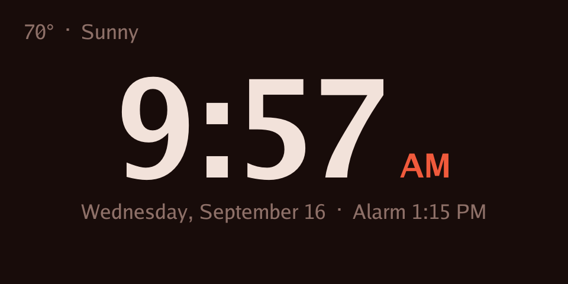
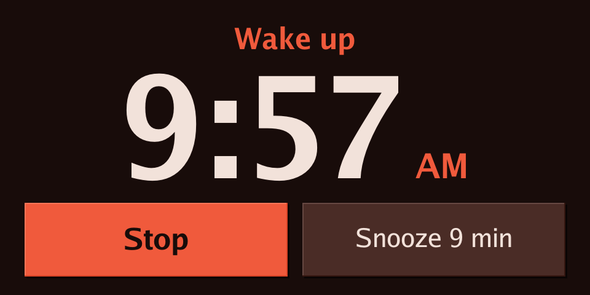
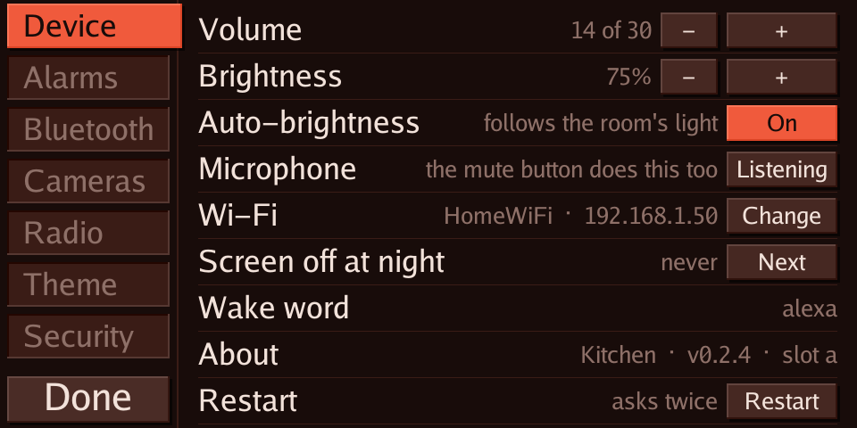
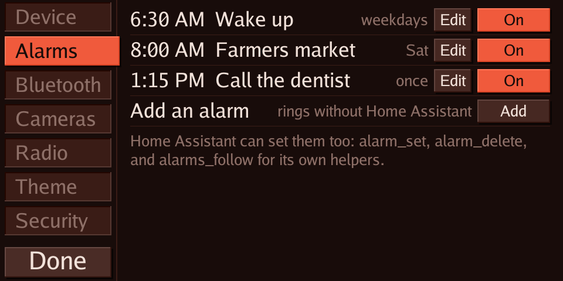
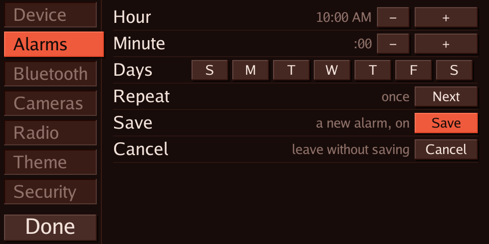
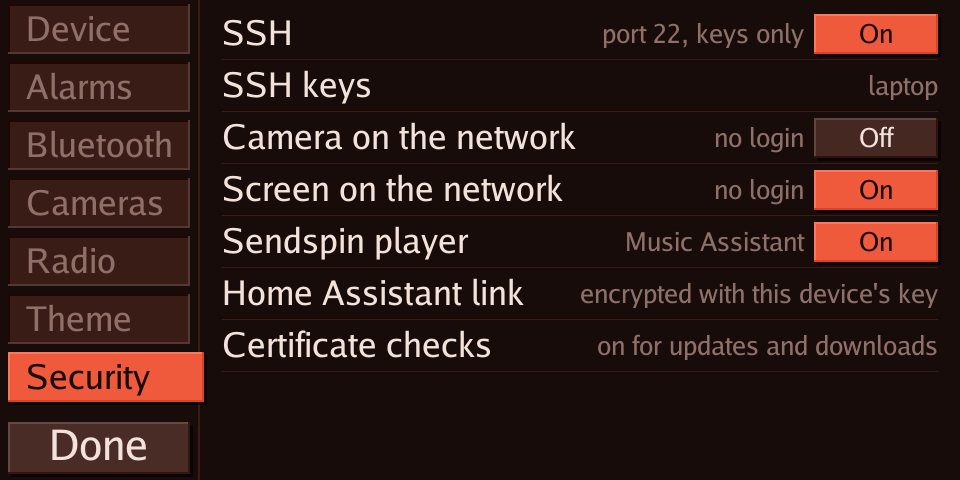
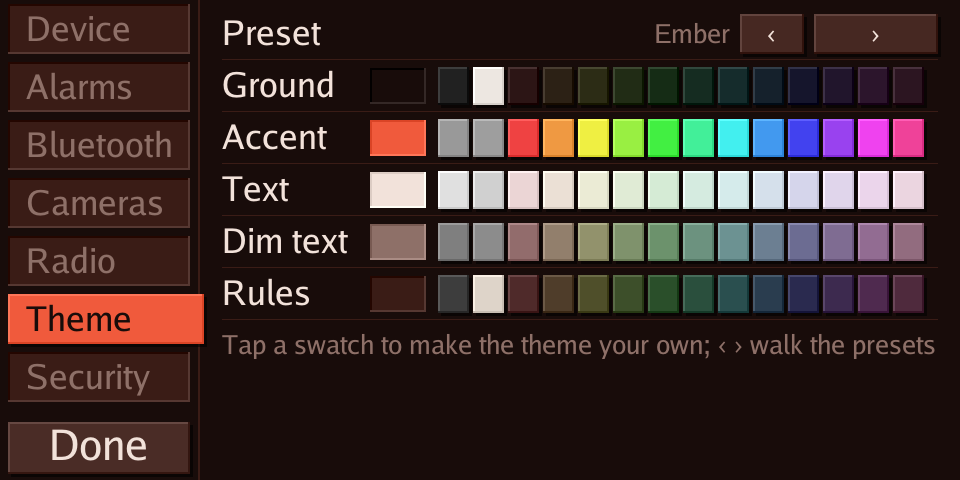

# TECHO5

[](https://buymeacoffee.com/huskerminion)

**Tech Echo 5** — an open, local-only firmware project for the Amazon Echo Show 5
(2nd generation, 2021, codename `cronos`).

The goal is a leaner and more capable replacement for the stock Alexa software:
a Home Assistant voice satellite with an on-device wake word, a native
`media_player`, and a dashboard display, with nothing leaving the house.

## Why

The Echo Show 5 is a 5.5-inch touchscreen, a far-field microphone array, a
speaker and a MediaTek MT8163 in a nice enclosure. Once the bootloader is
unlocked it is a small Linux computer that only needs three jobs done well:

1. hear a wake word and stream audio to Home Assistant Assist,
2. play speech and music,
3. show a dashboard.

Android is a lot of machinery for that. TECHO5 aims to do those jobs with a
small daemon and a kiosk, keep the hardware fully local, and stay easy to
update.

## Status

In daily use on a Show, with no Android at all: the unit boots its own Alpine Linux image and one
daemon (`echod/`) does everything. It is a Home Assistant voice satellite with an on-device wake
word and echo cancellation, a media player with radio and Bluetooth earbuds, a clock with weather,
timers and alarms, a camera entity, and a touch settings sheet; it updates itself over the air
from these releases into A/B slots with automatic fallback. [docs/overview.md](docs/overview.md) is
the one-page description; [docs/porting-plan.md](docs/porting-plan.md) is how it got here.

Getting there still takes an unlocked bootloader
([amonet-cronos](https://xdaforums.com/t/unlock-root-twrp-unbrick-amazon-echo-show-5-2nd-gen-2021-cronos.4772596/))
and the first-install steps in [tools/linux/README.md](tools/linux/README.md). A step-by-step
guide for a new unit is being written from a first install on a second Show.

## Screenshots

Taken from the device's own screen (`/screen.png`, with placeholders for names and addresses).

| | |
|---|---|
|  |  |
| Clock, weather and the next alarm | A ringing alarm |
|  |  |
| Settings: Device | Settings: Alarms |
|  |  |
| Setting an alarm | Settings: Security |
|  | |
| Settings: Theme | |

## Running the daemon beside LineageOS (the older route)

Before the Linux image, the daemon ran as an init service on LineageOS 18.1. That still works, on a
unit with USB debugging and rooted debugging enabled:

```powershell
cd echod
$env:GOOS='linux'; $env:GOARCH='arm'; $env:GOARM='7'; $env:CGO_ENABLED='0'
go build -trimpath -ldflags '-s -w' -o ../bin/echod-arm ./cmd/echod
cd ..
.\tools\install-cronos.ps1 -Serial <adb serial> -Name "Kitchen" -KeyFile .\kitchen.psk
```

The installer puts the daemon in place as an init service, switches Android to its null audio
HAL (the daemon owns the microphone and speaker), provisions the name, API key and wake word
models, and reboots. Home Assistant then discovers the device as an ESPHome node; paste the key
when asked. Android and any app on the screen keep running, silently.

## Approach

[EchoLocal](https://github.com/ygelfand/echolocal) (MIT) already turns the
Echo Dot 2 (`biscuit`, the same MT8163 family) into an ESPHome-native Home
Assistant satellite with a single static Go daemon that drives the hardware
directly. TECHO5 brought that daemon to `cronos`, added the display, camera,
Bluetooth and update layers it did not have, and put it on a minimal Alpine
root filesystem in place of Android.

See:

- [docs/hardware.md](docs/hardware.md) — what is known about the `cronos` hardware and the unlock path
- [docs/porting-plan.md](docs/porting-plan.md) — milestones and open questions

## Name

TECHO5 reads as "Tech Echo 5": the Echo hardware lineage and the 5.5-inch form
factor. Style it `TECHO5` or `tEcho5`.

## License

MIT. See [LICENSE](LICENSE).

TECHO5 is not affiliated with Amazon. Echo and Alexa are trademarks of
Amazon.com, Inc.
